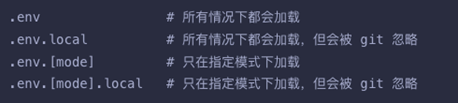
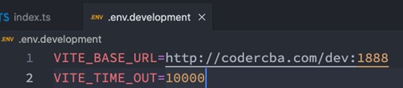

- Vite的环境变量：
- Vite在一个特殊的 import.meta.env对象上暴露环境变量。这里有一些在所有情况下都可以使用的内建变量：
  - import.meta.env.MODE: {string} 应用运行的模式。
  - import.meta.env.PROD: {boolean} 应用是否运行在生产环境。
  - import.meta.env.DEV: {boolean} 应用是否运行在开发环境 (永远与 import.meta.env.PROD相反)。
  - import.meta.env.SSR: {boolean} 应用是否运行在 server 上。
- Vite使用 dotenv从你的 环境目录 中的下列文件加载额外的环境变量：

- 只有以 VITE\_ 为前缀的变量才会暴露给经过 vite处理的代码。
